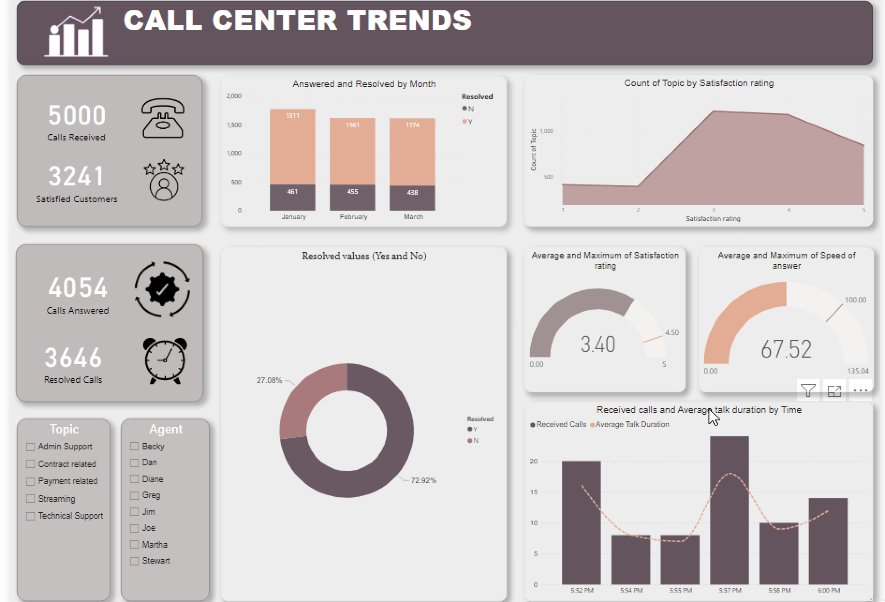

# PwC-Call-Centre-Analysis
## Introduction
This is a Power BI project that is part of the PwC Virtual Internship Program, a Comprehensive Call-Centre Trend Report that provides actionable insights to improve Customer Satisfaction and operations in a Telecommunication Organization.

## Key Performance Indicators (KPIs)
1. Total Calls Received: The number of calls received by the call center.
2. Resolved Calls: The number of calls with issues that were effectively resolved.
3. Calls Answered: The number of calls that were answered by agents of the organization.
4. Satisfied Customers: The customers that were satisfied with the services of the organization.
5. Average Answer Speed: The average time it takes an agent to answer an incoming call, _calculated in seconds_.
6. Calls by Month: Incoming calls over different months.

These Key Performance Indicators (KPIs) enable stakeholders to make informed decisions and advance continuous improvement projects by offering insightful data on a range of call center performance, consumer satisfaction, and operational efficiency concerns.

## Report

## Insights
- Call Analysis: The dashboard divulges that the Call Centre Received 5000 calls and 4054 calls were answered. Regardless, the 946 unanswered calls requires attention and it highlights improvement needed in minimizing high-traffic times and improving systems for resolving issues.
- Agent Performance: Eight agents are assigned to receiving the calls and seeking the high-performance agents will enable focused initiatives for training and recognition.
- Customer Satisfaction: The average rating for the Customer Satisfaction is 3.40 out of 5.0, there is need for improvement despite and increased quality despite this rating.

## Recommendations
- Regular training should be leveraged for the agents and successful agents should be provided with incentives to enhance efficiency.
- Procedures to reduce abandoned calls and maximizing staffing during high volume calls.
- Enhancing problem-solving techniques and obtaining feedback from customers on solutions and recommendations.
